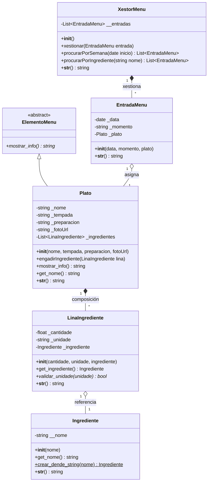

# Diagrama de Clases (Modificado)

## Xustificación das modificacións:
- **ElementoMenu (`Clase Abstracta`)**: Creada para cumprir o requisito de implementar unha clase abstracta/interface da cal derivar elementos. `Plato` herda dela, implementando a herdanza obrigatoria.
- **Atributos Privados/Protexidos**: Substituín a maioría dos atributos previamente públicos por privados (`_` e `__`). Engadíronse métodos getters (ex: `get_nome()`) nas partes necesarias.
- **Dunder Methods**: Engadiuse `__init__` e `__str__` en practicamente todas as entidades para permitir unha doada instanciación e presentación do obxecto por pantalla.
- **Métodos de clase/estáticos**: 
  - Engadiuse `crear_dende_string(nome)$` como método de clase (`@classmethod`) en `Ingrediente` para poder inicializalo por defecto.
  - Engadiuse `validar_unidade(unidade)*` como método estático (`@staticmethod`) en `LinaIngrediente` para validar a cadea da unidade (l, g, kg).
